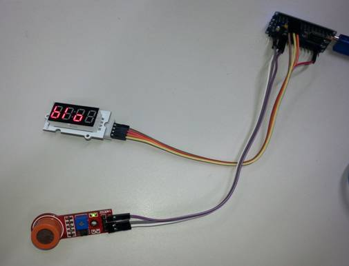

# Arduino Breathalyser

Although we call this one a breathalyser, the sensor we’re  using is not considered accurate enough to give useful readings. Still, when  everyone at the office heard we had an alcohol sensor, we had to have a go at  building one. We’ve gone with a compact form factor- a Duinotech Nano and a  Linker 4-digit 7-segment display. It’s all just free-wired, but should fit into  a small enclosure if you want to make something more permanent.

## Components

|Qty| Code | Description |
|---|---|---|
|1 | [XC4414](http://jaycar.com.au/p/XC4414) | duinotech NANO
|1 | [XC4540](http://jaycar.com.au/p/XC4540) | alcohol sensor module
|1 | [XC4569](http://jaycar.com.au/p/XC4569) | linker 4-digit 7-segment display
|1 | [WC6026](http://jaycar.com.au/p/WC6026) | socket-socket jumper lead

## Connections

Wire up as per the picture above, details in the table  below. Note that the two modules each need a ground connection. We’ve used the  ground connection near the digital pins for the display, and the one near the  analog pins for the alcohol sensor. Even though the display module is designed  to take a linker cable, it works well with the jumper leads too.

|Duinotech Nano |Display |Alcohol Sensor |Function
|--- |--- |--- |---
|5V ||VCC |Power
|GND |GND |GND |Ground
|3.3V |VCC ||Power
|D2 |DIO ||Data to display
|D3 |CLK| |Clock signal for display
|A7 ||A0|Analog signal for Alcohol Sensor

## Arduino Sketch

The Linker 4-digit 7-segment display needs a library to be  able to work, and this can be downloaded from [https://github.com/avishorp/TM1637](https://github.com/avishorp/TM1637). This library has some handy functions that make it very easy to run the  display. Install the library, open the IDE, then choose Nano (328) as the  board, and upload the sketch.

The sketch operates works by cycling through a few different  modes. The first mode displays ‘INI’, and an icon that cycles. During this  stage, the sketch is waiting for the reading on the alcohol sensor to  stabilise. The sensor will typically require being powered for up to 24 hours  on first use to evaporate the manufacturing residues on the internals of the  sensor, and then up to a minute for subsequent uses.

After this, the sketch moves into ready mode, where it  displays ‘BLO’. When the sketch detects a sudden change in the reading due to  being breathed on, it starts a counter icon to allow the air around the sensor  to stabilise before making its calculation.

The final phase is where the Breathalyser displays the  measured reading. It does this for 10 seconds, showing ‘BA:’, following by the  last two digits of the reading, eg 0.05% would be displayed as ‘BA:05’. The 10  second delay also allows time for the sensor to recover back to a resting  state. After this, the sketch will move to the ‘INI’ stage in case the sensor  hasn’t fully stabilised, and the cycle continues.

## Improvements

Although the sensor is nowhere near precise and repeatable  enough to be used as a reliable Breathalyser (readings also vary with  temperature and humidity, for example), it would be interesting to compare the  readings to that taken from a commercial breathalyser.

Another option would be to turn the project into a portable  unit, perhaps by adding a case and batteries. A 9V battery would probably only  run for an hour or so, because the alcohol sensor uses quite a bit if power, so  you could use a PH9206 6xAA Battery holder, and feed that into the VIN (+) and  GND (-) pins on the Nano.
